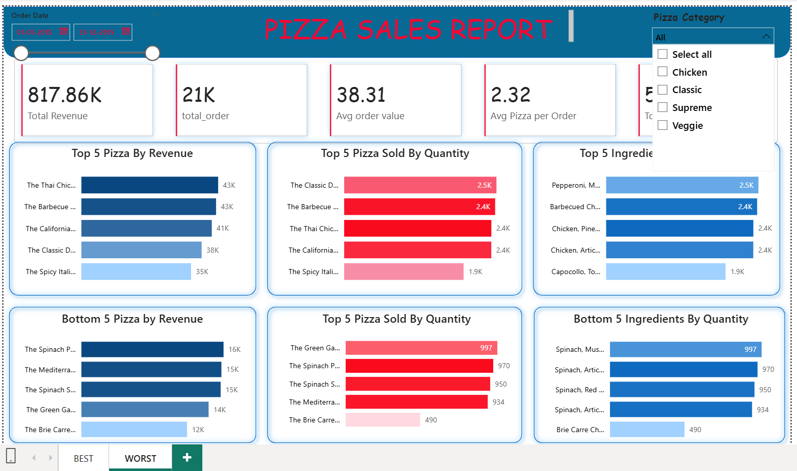

# 🍕 Pizza Sales Power BI Dashboard

## 📊 Dashboard Preview

### 🟢 Best Performing Insights

### 🔴 Worst Performing Insights

---

## 📌 Project Overview
This project is a Power BI dashboard created to analyse pizza sales data and understand how the business is performing. The goal was to turn raw sales data into clear, meaningful insights that can help in better decision-making.

---

## 🎯 Key Insights from the Dashboard
- Identified the best-selling and worst-selling pizzas
- Analysed revenue trends over different time periods
- Compared sales performance by pizza category and size
- Studied customer ordering patterns to understand demand

---

## 🛠 Tools & Technologies Used
- Microsoft Power BI  
- Data Cleaning and Transformation  
- Data Visualisation  
- Business Intelligence Concepts  

---

## 📁 Project Files
- `Pizza sales.pbix` – Main Power BI dashboard file  
- `dashboard-best.png` – Screenshot showing best-performing insights  
- `dashboard-worst.png` – Screenshot showing worst-performing insights  

---

## 🚀 Why I Built This Project
I built this project to practice real-world data analysis using Power BI and to understand how businesses can use data visualization to make smarter, data-driven decisions.

---

## 👨‍💻 Author
**Sagar**
